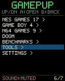
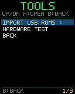
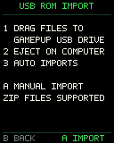
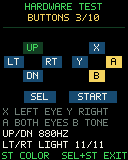
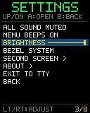
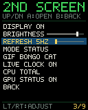
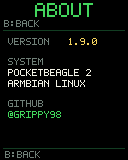
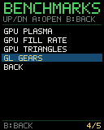
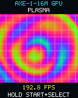
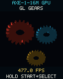

# PocketBeagle 2 + GamePup A4 on Armbian

An open-source PocketBeagle 2 port and tiny framebuffer game launcher for the
GamePup A4 cape. It combines native cape support, a controller-first game menu,
libretro emulation, PowerVR demonstrations, a USB ROM inbox, hardware tests,
and an optional 96x96 OLED dashboard.

> **Development note:** this project was created by
> [@Grippy98](https://github.com/Grippy98) with AI-assisted implementation and
> documentation using OpenAI Codex. Hardware behavior, performance, and the
> screenshots below were validated on a real PocketBeagle 2 and GamePup A4.

This overlay enables the GamePup A4 cape on the PocketBeagle 2:

- the ten buttons as a Linux `gpio-keys` keyboard;
- the ILI9341 display as DRM/fbdev (landscape 320x240);
- PWM display backlight;
- both eye LEDs;
- PWM buzzer;
- the Click socket's SPI device (`spidev`);
- OLED C Click control pins and a 96x96 system-status dashboard;
- a safe FAT32 USB ROM inbox alongside USB networking and serial;
- the cape EEPROM (`at24` on I2C2).

The cape's USB host port and I2C2 bus are already enabled by the stock PB2
device tree.

## Screenshots

The images below are native captures from the original 128x160 GamePup LCD.
They remain as historical UI references; the current tree targets an ILI9341
landscape **320x240** framebuffer. Click one to view it at its original pixel
resolution.

<table>
  <tr>
    <td align="center"><a href="docs/screenshots/home.png"></a><br><strong>Home</strong></td>
    <td align="center"><a href="docs/screenshots/tools.png"></a><br><strong>Tools</strong></td>
    <td align="center"><a href="docs/screenshots/rom-import.png"></a><br><strong>USB ROM import</strong></td>
    <td align="center"><a href="docs/screenshots/hardware-test.png"></a><br><strong>Hardware tester</strong></td>
  </tr>
  <tr>
    <td align="center"><a href="docs/screenshots/settings.png"></a><br><strong>Settings</strong></td>
    <td align="center"><a href="docs/screenshots/second-screen.png"></a><br><strong>Second screen</strong></td>
    <td align="center"><a href="docs/screenshots/about.png"></a><br><strong>About</strong></td>
    <td align="center"><a href="docs/screenshots/benchmarks.png"></a><br><strong>Benchmarks</strong></td>
  </tr>
  <tr>
    <td align="center"><a href="docs/screenshots/gpu-plasma.png"></a><br><strong>GPU plasma</strong></td>
    <td align="center"><a href="docs/screenshots/gpu-gears.png"></a><br><strong>GL gears</strong></td>
    <td align="center"><a href="emulator/gifs/bongo-cat.gif"></a><br><strong>OLED animation</strong></td>
  </tr>
</table>

Only project UI and original benchmark/art assets are shown here; no ROM or
commercial game imagery is included. Capture provenance is documented in
[`docs/screenshots/README.md`](docs/screenshots/README.md).

## Displays and render resolutions

The main ILI9341 LCD is a landscape **320x240** framebuffer using 32-bit XRGB
(`rotation = <90>` in the overlay; use `270` if your panel is upside-down).
Menus, the hardware tester, and GPU benchmarks render at the native 320x240
resolution. Games keep their intended aspect ratio and use the remaining space
for black bands or the optional bezel.

| Content | Source/render resolution | LCD game area | Letterbox |
|---|---:|---:|---|
| Menu, tools, tests | 320x240 | 320x240 | none |
| Game Boy / Game Boy Color | 160x144 | 266x240 | ~27 left/right |
| NES | 256x240 | 256x240 | 32 left/right |
| Nintendo 64 | 320x240 PowerVR pbuffer | 320x240 | none |
| Doom | normally 320x200 from PrBoom | 320x240, corrected to 4:3 | none (fills height) |
| PowerVR benchmarks | 320x240 OpenGL ES pbuffer | 320x240 | none |

The optional OLED C Click is a separate **96x96 RGB565** display. Both its
status dashboard and GIF mode render at 96x96; it does not mirror the main LCD.

## One-command install

On a 64-bit Armbian image for PocketBeagle 2, connect networking and run:

```sh
curl -fsSL https://raw.githubusercontent.com/Grippy98/PocketBeagle2-GamePup-Demo/main/quick-install.sh | sudo sh
```

This downloads the current `main` source and runs the complete installer. It
builds the pinned NES and Game Boy cores, cape support, menu and tools, PrBoom,
and the TI PowerVR stack. No ROMs are downloaded. Reboot when it finishes.

Reviewing a privileged network script before running it is always recommended.
The equivalent inspectable workflow is:

```sh
git clone https://github.com/Grippy98/PocketBeagle2-GamePup-Demo.git
cd PocketBeagle2-GamePup-Demo
sudo ./install-all.sh
sudo reboot
```

To skip an optional component in the one-command flow, pass its setting through
`sudo`, for example:

```sh
curl -fsSL https://raw.githubusercontent.com/Grippy98/PocketBeagle2-GamePup-Demo/main/quick-install.sh | sudo env GAMEPUP_INSTALL_GPU=0 sh
```

Use `GAMEPUP_INSTALL_DOOM=0` in the same way to omit PrBoom and the shareware
data. The Nintendo 64 core remains a separate Docker build, documented below,
because compiling it directly on the board is slow and memory-intensive.

## Manual installation

On BeagleBoard PocketBeagle 2 Debian 13.7 IoT (`v6.18.x-k3`), the stock kernel
leaves the DRM ILI9341 driver disabled, so `install.sh` builds the two required
matching upstream Linux modules against the installed headers, installs the
overlay, and adds it to `/boot/extlinux/extlinux.conf`.

```sh
sudo ./emulator/install-cores.sh
sudo ./install.sh
sudo reboot
```

The installer saves the original boot configuration as
`/boot/extlinux/extlinux.conf.before-gamepup-a4`.

## Cross-compile CI (host → aarch64)

GitHub Actions cross-compiles the overlay, userspace apps, libretro cores, and
ILI9341 DRM modules for **PocketBeagle 2 Debian 13.7 2026-09-20 IoT
(v6.18.x-k3)**. Target pins live in [`ci/target.env`](ci/target.env).

Locally on an amd64 Linux host:

```sh
sudo apt-get install -y gcc-14-aarch64-linux-gnu g++-14-aarch64-linux-gnu \
  device-tree-compiler qemu-user-static git curl
# also install Ubuntu ports arm64 -dev packages for EGL/GLES/gif (see workflow)
./scripts/cross-build.sh
```

On the PocketBeagle 2, install the userspace/CI artifact tree (bins, cores,
bezels; **skips** modules and dtbo):

```sh
sudo ./scripts/install-artifacts.sh ./dist
```

For a full artifact install including modules and overlay:

```sh
sudo ./scripts/install-dist.sh ./dist
```

Both installers also create `/opt/gamepup/games/{nes,gbc,n64,doom}` and install
Doom Shareware from the `doom-wad-shareware` package to
`/opt/gamepup/games/doom/Doom Shareware.wad` (same as `emulator/install-doom.sh`).

Artifacts land in `dist/` (`bin/`, `libretro/` including Nestopia, Gambatte,
PrBoom, and Mupen64Plus-Next, `modules/`, `dtbo/`). Set `SKIP_N64=1` to omit
the Nintendo 64 core. Download CI zips from the **Cross compile (PocketBeagle
2)** workflow run.

## Devices after reboot

- display: `/dev/dri/card*` and usually `/dev/fb0`;
- buttons: `/dev/input/by-path/*gamepup*` or the event device named
  `gamepup-buttons`/`gpio-keys`;
- Click SPI: `/dev/spidev0.0`;
- LEDs: `/sys/class/leds/gamepup:left-eye` and
  `/sys/class/leds/gamepup:right-eye`;
- buzzer: an input device named `gamepup-buzzer` or `pwm-beeper`;
- EEPROM: `/sys/bus/i2c/devices/2-0057/eeprom`.

When the PocketBeagle 2 device USB port is connected to a computer, the
composite gadget also presents a writable 2 GB FAT32 volume named `GAMEPUP`.

The installer adds `beagle` to `i2c` and a new `spi` group. The stock image
already puts `beagle` in `input` and `video`. Group changes take effect at the
next login.

To watch button events interactively:

```sh
sudo apt-get install evtest
evtest /dev/input/event0
```

Button key mappings match the original BeagleBoard GamePup overlay:

| Control | Linux key |
|---|---|
| D-pad | Arrow keys |
| Right pad left/right/up/down | P / Tab / Esc / Enter |
| Select / Start | 5 / 1 |

## Roll back

Restore `/boot/extlinux/extlinux.conf.before-gamepup-a4` over
`/boot/extlinux/extlinux.conf`, then reboot. The installed modules and overlay
can remain on disk harmlessly when they are no longer referenced.

Because these modules are built for one exact kernel release, rerun the
installer after a kernel upgrade if the new Armbian kernel still leaves the
ILI9341 driver disabled.

## Game Boy Color

The `emulator/` directory contains a minimal libretro frontend tailored to
the 320x240 GamePup framebuffer. Game Boy video scales to fill the panel height
(about 266x240) and is centered horizontally. ROMs are
user-supplied and kept outside this repository.

Controls:

| GamePup control | Game Boy control |
|---|---|
| D-pad | D-pad |
| Right-pad right (Tab) | A |
| Right-pad down (Enter) | B |
| Select (5) | Select |
| Start (1) | Start |
| Hold Start + Select | Exit |

The cape has a single PWM tone buzzer rather than PCM audio hardware. The
frontend converts the mixed emulator audio into an approximate monophonic tone
with silence gating and pitch tracking. It preserves recognizable melodies and
effects, but cannot reproduce the original multi-channel audio or volume.

## NES library

User-owned NES ROMs are stored separately under `/opt/gamepup/games/nes`.
The menu launches them through the Nestopia libretro core. NES video scales
from 256x240 to 256x240 on the landscape panel (with 32-pixel side pillars)
using bilinear sampling.

List installed games or preselect one by a unique portion of the title. After
preselecting over SSH, press A or Start on the GamePup to launch it:

```sh
gamepup-select
sudo gamepup-select galaga
sudo gamepup-select "mario brothers 3"
```

The button mapping is the same as above: the D-pad moves, right-pad right is A,
right-pad down is B, and the labeled Select and Start buttons map directly.

## Nintendo 64

The `N64 GAMES` folder launches user-owned `.z64`, `.n64`, and `.v64` images
through a pinned ARM64 build of Mupen64Plus-Next. GLideN64 renders into a
320x240 OpenGL ES 3 pbuffer on the AM625's PowerVR AXE-1-16M GPU; the frontend
reads that GPU result back and presents it 1:1 on the 320x240 LCD, with
optional side/top bezels when letterboxing remains. It explicitly rejects LLVMpipe and other
software renderers.

The PocketBeagle 2 has little memory available to the GPU's contiguous-memory
allocator, so the frontend selects a 320x240 render target and conservative
framebuffer/texture-cache options. Compatibility and frame rate will vary by
game, but this avoids the GPU allocation failures caused by larger targets.

Controls:

| GamePup control | Nintendo 64 control |
|---|---|
| D-pad | Analog stick |
| Hold Select + D-pad | C buttons |
| Right-pad right (Tab) | A |
| Right-pad down (Enter) | B |
| Right-pad up (Esc) | Z |
| Hold Select + right-pad up | L |
| Right-pad left (P) | R |
| Start (1) | Start |
| Hold Start + Select | Save and exit |

The core is pinned to commit
`98c1b0d877542b01314b3b04272282ba223b65b3`. Build it locally in an ARM64
Docker container, then copy the resulting shared library to the board:

```sh
./emulator/build-n64-docker.sh
scp emulator/build/n64/mupen64plus_next_libretro.so beagle@192.168.1.126:/tmp/
ssh beagle@192.168.1.126 \
  'sudo install -m 0755 /tmp/mupen64plus_next_libretro.so /usr/local/lib/libretro/'
```

ROMs remain outside this repository under `/opt/gamepup/games/n64`.

## Drag-and-drop ROM inbox

The `GAMEPUP` USB volume is a separate sparse FAT32 image, not the Linux root
filesystem. Its apparent capacity is 2 GB, while an empty inbox consumes only a
few megabytes on the SD card. It contains organizational folders for NES, Game
Boy, Nintendo 64, Doom, and OLED GIFs.

To install games from macOS, Windows, or Linux:

1. Drag supported files into the `GAMEPUP` drive.
2. Safely eject the drive on the computer.
3. GamePup automatically validates and imports the files, then reconnects the
   USB drive. The running menu refreshes its game counts without a reboot.

The importer accepts `.nes`, `.gb`, `.gbc`, `.z64`, `.n64`, `.v64`, `.wad`,
`.gif`, and ZIP archives containing those formats. It checks basic file headers,
ignores host metadata, prevents archive path traversal, and atomically installs
files into the appropriate `/opt/gamepup` directory. Identical files are left
unchanged. Inbox copies remain on the USB drive until deleted there.

`TOOLS > IMPORT USB ROMS` provides a manual fallback. Always eject the drive on
the host first; the importer detaches the mass-storage LUN while reading it so
Linux and the host never mount the FAT filesystem at the same time.

## Doom

The home screen includes a direct `DOOM` entry, which launches
`/opt/gamepup/games/doom/Doom Shareware.wad`. The Libretro PrBoom core provides
the game engine. The WAD is not part of this repository: the installer obtains
the shareware episode from Ubuntu's `doom-wad-shareware` package, whose own
data license applies.

Rebuild and reinstall the pinned ARM64 core and shareware data with:

```sh
sudo ./emulator/install-doom.sh
```

Doom is displayed at the intended 4:3 aspect ratio. The left D-pad moves and
turns; right-pad up fires, right opens/uses, left selects the previous weapon,
and down selects the next weapon. Select opens the automap, Start opens Doom's
menu, and holding Start+Select exits directly to the home screen.

## PowerVR GPU benchmark

The home screen's `BENCHMARKS` folder contains four hardware-only OpenGL ES
tests for the AM625's PowerVR AXE-1-16M GPU: `GPU PLASMA` stresses shader ALU,
`GPU FILL RATE` draws 48 blended full-screen layers per frame, and
`GPU TRIANGLES` submits 2,048 animated triangles per frame. `GL GEARS`
renders three lit, depth-tested 3D cogwheels. Each test renders at 320x240 with
TI's driver, rejects LLVMpipe or other software renderers, copies the result to
the GamePup LCD, and shows its measured frame rate. Hold Start+Select to return
to the benchmark folder.

On PocketBeagle 2 Debian IoT, do **not** install Mesa `libegl-dev` /
`libgles-dev` alongside the TI stack: those packages pull `libegl1`, which
conflicts with TI's `libegl-mesa0-pvr`. GamePup vendors Khronos EGL/GLES
headers under `emulator/khronos/` and links against TI's runtime libraries from
`ti-img-rogue-umlibs-am62`. `install-gpu.sh` removes conflicting Mesa packages
before installing the TI packages.

The GPU stack follows Armbian's
[`beagleplay.conf`](https://github.com/armbian/build/blob/main/config/boards/beagleplay.conf):
TI's AM62 DKMS kernel module, firmware, userspace/tools, and Mesa PVR packages
are installed from the official TI Debian repository. Install or refresh the
stack and benchmark with:

```sh
sudo ./emulator/install-gpu.sh
sudo reboot
```

The installer deliberately blacklists the upstream `powervr` module because
TI's proprietary userspace must be paired with its `pvrsrvkm` kernel module.
It also forces GCC 14 for DKMS to match the Armbian vendor kernel compiler.

## On-device menu

The `gamepup-game` service has a hierarchical framebuffer menu with folders for
NES, Game Boy/Color, Nintendo 64 games, benchmarks, and tools, plus direct Doom
and settings entries.
Use Up/Down to select, A or Start to enter/launch, and B to return to the home
screen. While playing, hold Start+Select for about one second to save, exit, and
return to the current game folder (or directly to the home screen from Doom).

Settings provides persistent toggles for all sound and menu beeps, an eight-step
hardware-PWM backlight slider adjusted with D-pad Left/Right, plus an
`EXIT TO TTY` action that stops the launcher and restores the Linux framebuffer
console. Muted games do not open the PWM buzzer device.

The `SECOND SCREEN` settings submenu provides persistent controls for turning
the OLED status display on or off, its eight-step brightness slider, a 5–30 Hz
refresh-rate slider, and a mode toggle between system status and animated GIFs.
Use Left/Right on the `GIF` row to select any animation installed in
`/opt/gamepup/gifs`; an original four-frame `bongo-cat.gif` is included. Status
mode also controls the live AM625 clock, total/per-core CPU view, and live
PowerVR utilization. Changes are applied immediately without a reboot.

`BEZEL` selects an optional main-display frame used while playing. `OFF` leaves
black letterbox bands, `GAMEPUP` uses the dark green house design, `ARCADE` uses
a cyan/magenta checker design, and `SYSTEM` automatically uses generated NES,
Game Boy Color, Nintendo 64, or Doom artwork with the system name split across
the top and bottom bands. All styles preserve the game's correct aspect ratio
and apply the next time a game is launched.

The Settings `ABOUT` page shows menu version 1.9.0, the PocketBeagle 2/Armbian
system identity, and the project owner's GitHub handle, `@Grippy98`.

When sound is enabled, menu navigation has short ascending/descending chirps,
launching a game has a confirmation sound, and returning from a game has a
descending back sound. These interface sounds also obey the mute setting.

The service temporarily unbinds the Linux framebuffer console while it is
active. This prevents tty1/getty cursor and keyboard updates from repainting
over the menu or game. Stopping the service reattaches the framebuffer console;
SSH and the serial console are unaffected throughout.

## Hardware tester

Open `TOOLS > HARDWARE TEST` to check all ten controls. A button turns yellow
while held and stays green after it has been tested. The same screen provides
direct output tests:

| Control | Test action |
|---|---|
| X / right-pad up | Left eye LED |
| Y / right-pad left | Right eye LED |
| A / right-pad right | Both eye LEDs |
| B / right-pad down | Play the displayed buzzer frequency |
| D-pad Up/Down | Adjust buzzer frequency from 200–2000 Hz |
| D-pad Left/Right | Adjust LCD backlight |
| Start | Cycle red, green, blue, white, black, color bars, and the UI |
| Hold Start+Select | Exit the tester |

Opening the tester briefly sequences both LEDs and plays an 880 Hz confirmation
tone. The tester intentionally writes straight to the PWM buzzer and therefore
works even when game/menu audio is muted. It switches the LEDs and buzzer off
and restores the original backlight level when it exits.

## OLED C status display

An OLED C Click in the GamePup mikroBUS socket is driven independently from the
main LCD. The `gamepup-oled-status` service is adjustable from 5–30 Hz and shows
the live
AM625 clock frequency, CPU and RAM percentages, live GPU utilization, and the
measured emulator or benchmark frame rate. The bottom line identifies the
current activity as `MENU`, `NES`, `GBC`, `N64`, `DOOM`, or `GPU`. At the menu,
FPS is zero because the menu redraws only in response to input rather than
running a frame loop.

The implementation targets the 96x96 SSD1351 OLED C Click (board revisions 1.01
and later) and uses the manufacturer's RGB565 initialization values at an
18 MHz SPI clock. After its initial full frame, the service sends only changed
rectangles to keep high refresh rates efficient. The service is enabled by
`install.sh` and starts after the overlay is active on the next boot.

## License and redistribution

This repository is licensed under **GNU GPL version 2 only**; see
[`LICENSE`](LICENSE). The v2-only choice preserves compatibility with the
original BeagleBoard.org GamePup overlay on which the PocketBeagle 2 port is
based.

ROMs, BIOS files, libretro core binaries, TI PowerVR packages, and Doom data are
not included. They retain their respective upstream licenses and, for games,
must be supplied or obtained lawfully by the user. See
[`THIRD_PARTY_NOTICES.md`](THIRD_PARTY_NOTICES.md) before redistributing a built
image or binary package.
